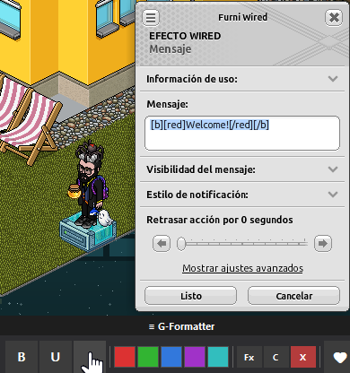
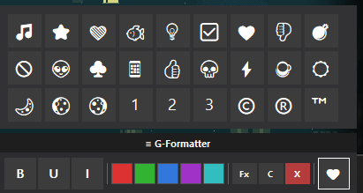

# G-Formatter

A lightweight text styling extension for Wired chat in Habbo Hotel. Apply BBCode formatting (bold, underline, italic), colors, and emojis to your selected text with a simple floating toolbar.

## Features

- **Text formatting**: Bold, underline, italic (toggle on/off)
- **Text colors**: Red, green, blue, purple, cyan
- **Clear options**: Remove only colors, only formatting, or all BBCode tags
- **Emoji panel**: Insert special symbols and decorative characters
- **Floating UI**: Always on top, draggable toolbar
- **Auto-reselect**: Formatted text stays selected after applying changes

## Requirements

- Windows 10 or later
- [G-Earth](https://github.com/sirjonasxx/G-Earth) with Extension API enabled
- [.NET 8.0 Runtime](https://dotnet.microsoft.com/en-us/download/dotnet/8.0) (Windows Desktop Runtime)

> **Important**: You must install the .NET 8.0 Runtime separately. The extension will not work without it.

## Installation

1. Download and install [.NET 8.0 Runtime](https://dotnet.microsoft.com/en-us/download/dotnet/8.0) if not already installed
2. Install from the G-Extension Store or from the release section in this repository
3. Extract the folder from the .RAR file and place it in the `Extensions` folder of G-Earth. (Only if you downloaded the release manually)
4. Launch G-Earth, go to Extensions, and enable G-Formatter

## Usage

### Apply formatting or color

1. Select any text in Habbo chat input or any text field that supports BBCode
2. Click the desired button on the G-Formatter toolbar
3. The formatted text will replace your selection and remain selected for further edits

### Remove formatting

- **Fx**: Removes bold/underline/italic tags only
- **C**: Removes color tags only  
- **X**: Removes all BBCode tags (formatting + colors)

### Emoji panel

Click the black heart button (🖤) to open the emoji panel. Click any emoji to insert it at the current cursor position.

## Screenshots

### Main toolbar

*The floating toolbar with formatting, color, and clear options*

### Emoji panel

*Emoji panel with special characters for decorative text*

## Supported BBCode Tags

| Format | Tag |
|--------|-----|
| Bold | `[b]text[/b]` |
| Underline | `[u]text[/u]` |
| Italic | `[i]text[/i]` |
| Red | `[red]text[/red]` |
| Green | `[green]text[/green]` |
| Blue | `[blue]text[/blue]` |
| Purple | `[purple]text[/purple]` |
| Cyan | `[cyan]text[/cyan]` |

## Troubleshooting

**Toolbar doesn't appear**: Make sure G-Formatter is enabled in G-Earth Extensions and you are connected to a hotel.

**Unable to load extension" or missing dependencies**: You need to install the .NET 8.0 Runtime from the link above.

**Formatting doesn't apply**: The text field must support BBCode (Habbo chat, room name, group MOTD, etc.)

**Emoji panel closes unexpectedly**: The panel is designed to stay open until you click the emoji button again or click outside.

## License

Private use only. Created by BigBenitocamelo.

## Version

1.0.0