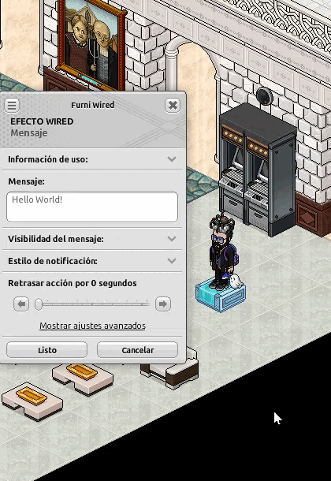

# G-Formatter

A lightweight, smart text styling extension for Wired chat in Habbo Hotel. Apply BBCode formatting (bold, underline, italic), colors, and emojis to your selected text with a sleek, floating toolbar.

## What's New in v1.1.0 !?
- **Smart Hover Menus**: Submenus for Colors, Clear options, and Clipboard now open automatically on hover.
- **Settings Panel**: A dedicated configuration menu to customize your experience.
- **Dynamic Opacity**: The UI fades out when idle to avoid blocking your screen and lights up when you interact with it.
- **Pause Mode**: Temporarily suspend the extension's keyboard and mouse hooks without closing the app.
- **Keyboard Shortcuts**: Quickly format text or open settings using native Windows shortcuts.

## Features

- **Text formatting**: Bold, underline, italic (toggle on/off).
- **Text colors**: Red, green, blue, purple, cyan.
- **Clear options**: Remove only colors, only formatting, or all BBCode tags instantly.
- **Emoji panel**: Insert special symbols and decorative characters.
- **Clipboard Tools**: Quick access to Cut, Copy, Paste, and Select All.
- **Auto-reselect**: Formatted text stays selected after applying changes for continuous editing.

## Requirements

- Windows 10 or later
- [G-Earth](https://github.com/sirjonasxx/G-Earth) with Extension API enabled
- [.NET 8.0 Runtime](https://dotnet.microsoft.com/en-us/download/dotnet/8.0) (Windows Desktop Runtime)

> **Important**: You must install the .NET 8.0 Runtime separately. The extension will not work without it.

## Installation

1. Download and install [.NET 8.0 Runtime](https://dotnet.microsoft.com/en-us/download/dotnet/8.0) if not already installed.
2. Install from the G-Extension Store or download the latest release from this repository.
3. If downloaded manually, extract the folder from the `.zip`/`.rar` file and place it inside the `Extensions` folder of G-Earth.
4. Launch G-Earth, go to the Extensions tab, and enable G-Formatter.

## Keyboard Shortcuts

G-Formatter seamlessly integrates with your keyboard for a faster building experience.

| Shortcut | Action |
|----------|--------|
| `Ctrl + B` | Toggle **Bold** format |
| `Ctrl + U` | Toggle **Underline** format |
| `Ctrl + I` | Toggle **Italic** format |
| `Ctrl + Shift + S` | Open the **Settings Panel** |

## Usage Guide

### Apply formatting or color
1. Select any text in Habbo chat input or any text field that supports BBCode.
2. Use the keyboard shortcuts or click the desired button on the G-Formatter toolbar.
3. The formatted text will replace your selection and remain selected for further edits.

### Hover Submenus
Hover your mouse over the **Color**, **Clear (Fx)**, or **Clipboard (📋)** buttons for half a second to reveal their advanced options.

### Customizing Settings
Press `Ctrl + Shift + S` at any time to open the Settings Panel. Here you can:
- **Pause Extension**: Temporarily disable the extension's shortcuts and hooks.
- **Idle Opacity**: Adjust how transparent the main toolbar becomes when you move your mouse away.

## Previews

### Smart Menus in Action

*Hover over buttons to reveal submenus and apply colors or clipboard actions seamlessly.*

### Settings & Opacity

*Adjust the idle opacity or pause the extension completely using the new settings panel.*

## Supported BBCode Tags

| Format | Tag |
|--------|-----|
| Bold | `[b]text[/b]` |
| Underline | `[u]text[/u]` |
| Italic | `[i]text[/i]` |
| Red | `[red]text[/red]` |
| Green | `[green]text[/green]` |
| Blue | `[blue]text[/blue]` |
| Purple | `[purple]text[/purple]` |
| Cyan | `[cyan]text[/cyan]` |

## Troubleshooting

- **Toolbar doesn't appear**: Make sure G-Formatter is enabled in G-Earth Extensions and you are connected to a hotel.
- **Shortcuts aren't working**: Check if the extension is paused in the Settings Panel (`Ctrl + Shift + S`).
- **Unable to load extension or missing dependencies**: You need to install the .NET 8.0 Runtime from the link above.
- **Formatting doesn't apply**: The text field must support BBCode (Habbo chat, room name, group MOTD, etc.).

## License

Private use only. Created by BigBenitocamelo.

## Version

1.1.0